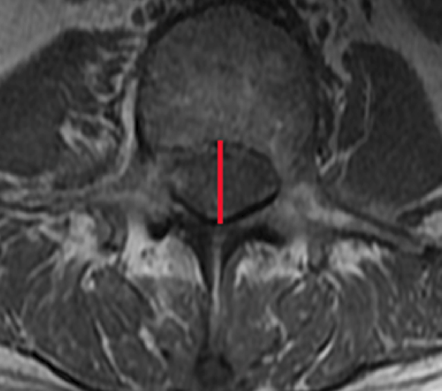
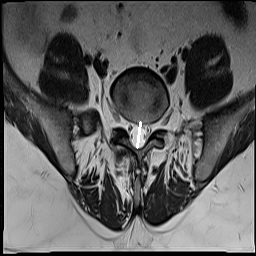
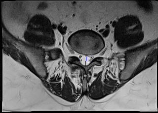

# Obective
Given axial spine mri image we need to determine the canal diameter  

# Dataset

- Dataset used is https://data.mendeley.com/datasets/zbf6b4pttk/2 
- Total number of spinal axial MRI images are 1545
- The image annotations are shown below
- 1) Intervertebral Disc (IVD) --> labeled with red color in the image shown below
- 2) Posterior Element (PE) --> labeled with green color in the image shown below
- 3) Thecal Sac (TS) and --> labeled with blue color in the image shown below
- 4) the Area between Anterior and Posterior (AAP) vertebrae elements. --> labeled with yellow color in the image shown below

# 1. Image segmentation using a UNET model

## Details:
- I have used a UNET model since It is generally used for biomedical segmentation(256x256)
- Loss function used was Dice loss since It helps with balanced segmentation
- Notebook link for training-> https://github.com/trinanjan12/spinal_chord_segmentation/blob/master/train_unet.ipynb
- Notebook link for testing segmentation-> https://github.com/trinanjan12/spinal_chord_segmentation/blob/master/test.ipynb

## Find canal diameter:

- Once we have image parts correctly segmented , we can use geometry to find the canal diameter
- We need to find the minimum point of the red area(Intervertebral Disc (IVD)) and the minimum point of the area between Anterior and Posterior (AAP) vertebrae elements (yellow area).
- The distance between these 2 points will be the canal diameter
- Notebook link for find diameter of the canal-> https://github.com/trinanjan12/spinal_chord_segmentation/blob/master/draw_spinal_chord_diameter.ipynb

## Results:
- The results are highly dependent on the accuracy of the segmentation model

## 1. Test prediction with white line

## 2. Original label with blue line
